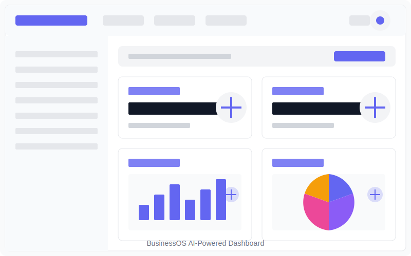

# BusinessOS

<div align="center">
  
  <h3>AI-First Business Management Platform</h3>
  <p>An open-source, AI-powered business management platform for small businesses.</p>
  
  [](https://opensource.org/licenses/MIT)
  [](https://reactjs.org/)
  [](https://fastapi.tiangolo.com/)
  [](https://supabase.io/)
  [](https://azure.microsoft.com/en-us/products/cognitive-services/openai-service/)
</div>

## 🌟 Features

- **Document Management**: AI-powered document processing, classification, and analysis
- **Finance Management**: Transaction tracking, budgeting, and financial reporting
- **HR & People Management**: Employee management, department organization, and performance tracking
- **Project Management**: Task tracking, project planning, and team collaboration
- **AI Assistants**: Intelligent assistants to help with various business tasks
- **Authentication & User Management**: Secure authentication and role-based access control

## 📋 Table of Contents

- [Prerequisites](#prerequisites)
- [Installation](#installation)
  - [Clone the Repository](#clone-the-repository)
  - [Frontend Setup](#frontend-setup)
  - [Backend Setup](#backend-setup)
  - [Database Setup](#database-setup)
- [Environment Variables](#environment-variables)
  - [Frontend Environment](#frontend-environment)
  - [Backend Environment](#backend-environment)
  - [Supabase Setup](#supabase-setup)
  - [Azure OpenAI Setup](#azure-openai-setup)
- [Running the Application](#running-the-application)
  - [Development Mode](#development-mode)
  - [Production Mode](#production-mode)
- [Project Structure](#project-structure)
- [API Documentation](#api-documentation)
- [Contributing](#contributing)
- [License](#license)
- [Support](#support)

## 🔧 Prerequisites

Before you begin, ensure you have the following installed:

- [Node.js](https://nodejs.org/) (v16 or later)
- [Python](https://www.python.org/) (v3.9 or later)
- [uv](https://github.com/astral-sh/uv) (Python package installer)
- [Git](https://git-scm.com/)
- [Supabase CLI](https://supabase.com/docs/guides/cli) (optional, for local development)

## 🚀 Installation

### Clone the Repository

```bash
git clone https://github.com/yourusername/businessOS.git
cd businessOS
```

### Frontend Setup

```bash
# Navigate to the frontend directory
cd frontend/business-flow-canvas-suite-main

# Install dependencies
npm install

# Create a .env file (see Environment Variables section)
cp .env.example .env
```

### Backend Setup

```bash
# Navigate to the backend directory
cd backend

# Create a virtual environment
python -m venv venv

# Activate the virtual environment
# On Windows
venv\Scripts\activate
# On macOS/Linux
source venv/bin/activate

# Install dependencies using uv
uv pip install -r requirements.txt

# Create a .env file (see Environment Variables section)
cp .env.example .env
```

### Database Setup

BusinessOS uses Supabase for database and storage. You'll need to:

1. Create a Supabase account at [supabase.com](https://supabase.com)
2. Create a new project
3. Run the database migration scripts

```bash
# Navigate to the database directory
cd database

# Run the migration scripts
# Option 1: Using the Supabase CLI
supabase db push

# Option 2: Manually run the SQL scripts in the Supabase SQL editor
# Open each file in the migrations directory and run them in order
```

## 🔐 Environment Variables

### Frontend Environment

Create a `.env` file in the `frontend/business-flow-canvas-suite-main` directory with the following variables:

```env
# Supabase Configuration
VITE_SUPABASE_URL=https://your-supabase-project-url.supabase.co
VITE_SUPABASE_ANON_KEY=your-supabase-anon-key

# API Configuration
VITE_API_URL=http://localhost:8000

# Optional: Analytics
VITE_GA_TRACKING_ID=your-ga-tracking-id
```

### Backend Environment

Create a `.env` file in the `backend` directory with the following variables:

```env
# Server Configuration
DEBUG=True
HOST=0.0.0.0
PORT=8000
ALLOWED_ORIGINS=http://localhost:5173,http://localhost:4173

# Supabase Configuration
SUPABASE_URL=https://your-supabase-project-url.supabase.co
SUPABASE_SERVICE_KEY=your-supabase-service-key

# Azure OpenAI Configuration
AZURE_OPENAI_API_KEY=your-azure-openai-api-key
AZURE_OPENAI_API_BASE=https://your-azure-openai-resource.openai.azure.com
AZURE_OPENAI_API_VERSION=2023-05-15
AZURE_OPENAI_DEPLOYMENT_NAME=your-deployment-name
AZURE_OPENAI_EMBEDDING_DEPLOYMENT_NAME=your-embedding-deployment-name

# Agno Configuration (for document processing)
AGNO_API_KEY=your-agno-api-key
```

### Supabase Setup

1. Create a new project on [Supabase](https://supabase.com)
2. Get your project URL and anon key from the project settings
3. Create the following buckets in Supabase Storage:
   - `documents` - for storing document files
   - `avatars` - for storing user avatars
4. Set up the following tables (or run the migration scripts):
   - `profiles` - User profiles
   - `documents` - Document metadata
   - `document_versions` - Document version history
   - `document_permissions` - Document sharing permissions
   - `ai_assistant_conversations` - AI assistant conversation history
   - `budget_categories` - Budget categories
   - `budget_expenses` - Budget expenses
   - `transactions` - Financial transactions
   - `employees` - Employee information
   - `departments` - Department information
   - `audit_logs` - System audit logs

### Azure OpenAI Setup

1. Create an Azure OpenAI resource in the [Azure Portal](https://portal.azure.com)
2. Deploy the following models:
   - `gpt-35-turbo` or `gpt-4` for text generation
   - `text-embedding-ada-002` for embeddings
3. Get your API key, endpoint, and deployment names from the Azure Portal

## 🏃‍♂️ Running the Application

### Development Mode

#### Frontend

```bash
# Navigate to the frontend directory
cd frontend/business-flow-canvas-suite-main

# Start the development server
npm run dev
```

The frontend will be available at `http://localhost:5173`

#### Backend

```bash
# Navigate to the backend directory
cd backend

# Activate the virtual environment
# On Windows
venv\Scripts\activate
# On macOS/Linux
source venv/bin/activate

# Start the development server
uvicorn app.main:app --reload --host 0.0.0.0 --port 8000
```

The backend API will be available at `http://localhost:8000`

### Production Mode

#### Frontend

```bash
# Navigate to the frontend directory
cd frontend/business-flow-canvas-suite-main

# Build for production
npm run build

# Serve the built files
npm run preview
```

#### Backend

```bash
# Navigate to the backend directory
cd backend

# Start the production server
uvicorn app.main:app --host 0.0.0.0 --port 8000
```

For production deployment, we recommend using a process manager like PM2 or deploying with Docker.

## 📁 Project Structure

```
businessOS/
├── frontend/                  # Frontend React application
│   └── business-flow-canvas-suite-main/
│       ├── public/            # Static assets
│       ├── src/               # Source code
│       │   ├── components/    # Reusable components
│       │   ├── contexts/      # React contexts
│       │   ├── hooks/         # Custom hooks
│       │   ├── layouts/       # Page layouts
│       │   ├── pages/         # Page components
│       │   ├── services/      # API services
│       │   ├── styles/        # CSS styles
│       │   ├── utils/         # Utility functions
│       │   ├── App.tsx        # Main application component
│       │   └── main.tsx       # Entry point
│       ├── .env               # Environment variables
│       └── package.json       # Dependencies and scripts
│
├── backend/                   # Backend FastAPI application
│   ├── app/                   # Source code
│   │   ├── api/               # API endpoints
│   │   ├── core/              # Core functionality
│   │   ├── db/                # Database models and connections
│   │   ├── models/            # Pydantic models
│   │   ├── services/          # Business logic
│   │   ├── utils/             # Utility functions
│   │   └── main.py            # Entry point
│   ├── .env                   # Environment variables
│   └── requirements.txt       # Python dependencies
│
├── agno-main/                 # Agno document processing library
│
├── database/                  # Database migration scripts
│   └── migrations/            # SQL migration files
│
├── project_tracker.md         # Project tracking document
├── project_details.md         # Project details and documentation
└── README.md                  # This file
```

## 📚 API Documentation

Once the backend server is running, you can access the API documentation at:

- Swagger UI: `http://localhost:8000/docs`
- ReDoc: `http://localhost:8000/redoc`

## 🤝 Contributing

We welcome contributions to BusinessOS! Please see our [Contributing Guidelines](CONTRIBUTING.md) for more details.

1. Fork the repository
2. Create a feature branch: `git checkout -b feature/my-feature`
3. Commit your changes: `git commit -am 'Add my feature'`
4. Push to the branch: `git push origin feature/my-feature`
5. Submit a pull request

## 📄 License

This project is licensed under the MIT License - see the [LICENSE](LICENSE) file for details.

## 🆘 Support

If you encounter any issues or have questions, please:

- Open an issue on GitHub
- Join our community Discord server
- Check the documentation

---

<div align="center">
  <p>Built with ❤️ by the BusinessOS Team</p>
  <p>
    <a href="https://github.com/yourusername/businessOS">GitHub</a> •
    <a href="https://yourusername.github.io/businessOS">Documentation</a> •
    <a href="https://discord.gg/yourdiscord">Discord</a>
  </p>
</div>
